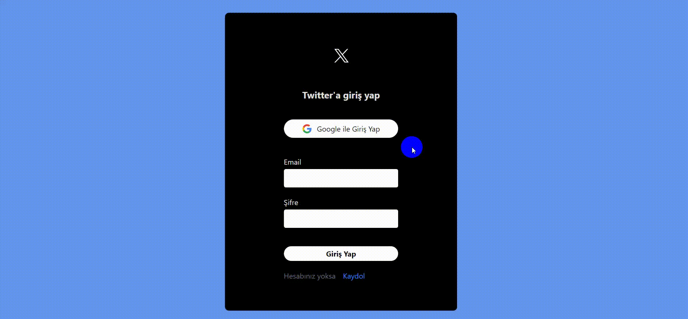

# X- Twitter Clone

This README file will guide you on how to get started with the X-Twitter clone React application and understand its basic functionality. Assuming that you've already integrated Firebase into your application, follow the steps below:

## Project Setup

Clone the project code to your computer:

git clone https://github.com/hasanyalsiz/X-TwitterClone
cd x-twitter-clone

`npm install`
`npm start`

# Using the Application
When you open the application in your browser, you'll be prompted to log in or create an account. You can log in using your Google account or email address.

After logging in, you can view tweets on the main screen, create new tweets, edit existing tweets, and delete them.

Use the "Log Out" link under the tweets to log out of the application.
# x-clone
